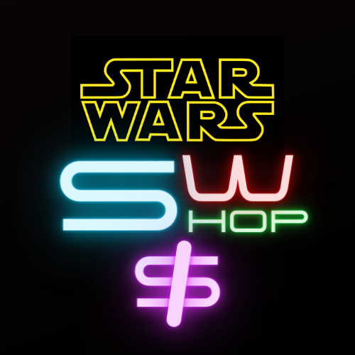

# Star Wars Shop


<div align="center">
  <a href="https://github.com/othneildrew/Best-README-Template">
    
  </a>
</div>

## Sobre el Proyecto

Este trabajo forma parte del curso de React de [CoderHouse](https://www.coderhouse.com), y consiste en una tienda online inventada que vende productos relacionados con las series y películas de Star Wars.

## Ejecución del Proyecto

1. Clona el repositorio
   ```sh
   git clone https://github.com/your_username_/Project-Name.git
   ```
2. Instala los paquetes NPM
   ```sh
   npm install
   ```
3. Corre la app y abre [http://localhost:3000](http://localhost:3000) para verlo en tu navegador.
   ```sh
   npm start
   ```

## Herramientas Utilizadas

* [![React][React.js]][React-url]
* [![Toastify][Toastify.js]][Toastify-url]
* [![Sass][Sass.scss]][Sass-url]

## Deploy de la página

[https://master--starwarsshop.netlify.app](https://master--starwarsshop.netlify.app)


[React.js]: https://img.shields.io/badge/React-20232A?style=for-the-badge&logo=react&logoColor=61DAFB
[React-url]: https://reactjs.org/
[Sass.scss]: https://img.shields.io/badge/Sass-20232A?style=for-the-badge&logo=sass&logoColor=CC6699
[Sass-url]: https://sass-lang.com
[Toastify.js]: https://img.shields.io/badge/Toastify%20Js-20232A?style=for-the-badge&logo=toastify&logoColor=CC6699
[Toastify-url]: https://www.npmjs.com/package/react-toastify